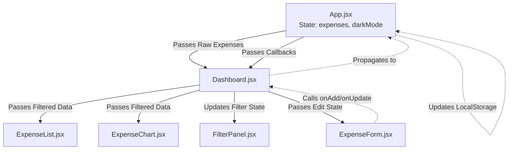

# ExpenseFlow Architecture & Code Explanation

Here is a full breakdown of the project structure, how the data flows, and an explanation of the core functionalities, including the search and dropdowns we just fixed!

## 1. Project Structure

The project is built with React and styled using TailwindCSS. It follows a clean separation of concerns, dividing code into hooks, utilities, UI components, and pages.

```text
src/
├── main.jsx                 # Entry point, mounts App to the DOM
├── App.jsx                  # Root Component (Global State)
├── index.css                # Global CSS (Tailwind imports & custom classes)
│
├── hooks/
│   └── useLocalStorage.js   # Custom hook for persistent state
│
├── utils/
│   ├── calculations.js      # Math helpers (e.g. summing expenses)
│   ├── categories.js        # Category definitions and icons
│   └── validation.js        # Form validation logic
│
├── pages/
│   └── Dashboard.jsx        # Main Page layout and filtering logic
│
└── components/
    ├── Header.jsx           # Top sticky header
    ├── FilterPanel.jsx      # Search, Category dropdown, and Date inputs
    ├── ExpenseForm.jsx      # Handles Add / Edit forms
    ├── ExpenseList.jsx      # Desktop Table / Mobile Card layout container
    ├── ExpenseCard.jsx      # Mobile view for an individual expense
    ├── CategoryBadge.jsx    # Visual pill for category representation
    ├── ExpenseChart.jsx     # Visual data summary
    ├── SummarySection.jsx   # Top stat cards (Total spent, Avg, etc)
    ├── ConfirmModal.jsx     # Delete confirmation prompt
    └── Toast.jsx            # Temporary notification popups
```

## 2. Global State & Data Flow (App.jsx)

> [!NOTE]
> ExpenseFlow relies purely on local storage rather than a backend database.

The application adheres strictly to the **Single Source of Truth** principle.

[App.jsx](file:///c:/Users/Muntaha/Downloads/expenseflow-project/expenseflow/src/App.jsx) holds the core, unmutated list of expenses. Instead of using a standard `useState`, it uses the custom hook [useLocalStorage](file:///c:/Users/Muntaha/Downloads/expenseflow-project/expenseflow/src/hooks/useLocalStorage.js). 



Whenever you Add, Edit, or Delete an expense, `App.jsx` updates its state, saves to Local Storage, and React automatically cascades the updated array down through the components.

## 3. Filtering and Searching (Dashboard.jsx)

The [Dashboard.jsx](file:///c:/Users/Muntaha/Downloads/expenseflow-project/expenseflow/src/pages/Dashboard.jsx) component acts as the orchestrator. It receives the full array of expenses from `App.jsx` and maintains the **Filter State**. 

The filter state looks like this:
```javascript
const [filters, setFilters] = useState({
  search:   '',
  category: '',
  from:     '',
  to:       '',
  sortBy:   'date',
  sortDir:  'desc',
})
```

### The Magic of `useMemo`
The Dashboard applies all active filters and sorts the data inside a `useMemo` hook. This ensures the complex filtering calculations only re-run when the raw expenses array or the filter state actually changes.

```javascript
  const filtered = useMemo(() => {
    let list = [...expenses]

    // 1. TEXT SEARCH (Case-Insensitive)
    if (filters.search) {
      const q = filters.search.toLowerCase()
      list = list.filter(e => e.title.toLowerCase().includes(q))
    }

    // 2. CATEGORY DROPDOWN MATCHING
    if (filters.category) {
      list = list.filter(e => e.category === filters.category)
    }

    // 3. DATE RANGE FILTERING
    if (filters.from) list = list.filter(e => e.date >= filters.from)
    if (filters.to)   list = list.filter(e => e.date <= filters.to)

    // 4. SORTING
    // (Sorts by date or amount based on configuration)
    
    return list
  }, [expenses, filters])
```

## 4. The FilterPanel Component

[FilterPanel.jsx](file:///c:/Users/Muntaha/Downloads/expenseflow-project/expenseflow/src/components/FilterPanel.jsx) is what we affectionately call a **"Controlled Component"**. 
It does not own the data it displays. Instead:
1. It receives the `filters` state from `Dashboard`.
2. Whenever a user types in the search bar or selects a category, `FilterPanel` fires the `onChange` callback.
3. `Dashboard` updates its state, triggering the `useMemo` hook, producing a newly filtered array that gets sent directly to the `ExpenseList` to render.

> [!TIP]
> **Native vs Custom Dropdowns**
> 
> The Category selection utilizes the native HTML `<select>` tag. While styling `<select>` tags can be slightly more limited than building a custom unordered-list (`<ul>`) dropdown component, the native approach handles all screen-reader ARIA accessibility and keyboard navigation (Up, Down, Space, Enter) directly out of the box with flawless browser support!

## 5. Layout and Responsiveness

The UI dynamically adapts to the user's screen size using CSS Media Queries and a Javascript `window.matchMedia` hook.

Inside [ExpenseList.jsx](file:///c:/Users/Muntaha/Downloads/expenseflow-project/expenseflow/src/components/ExpenseList.jsx), the component checks the screen width:
- **Desktop (`>= 768px`)**: Renders a sleek, scannable `<table class="w-full">`.
- **Mobile (`< 768px`)**: Renders a vertical stack of [ExpenseCard.jsx](file:///c:/Users/Muntaha/Downloads/expenseflow-project/expenseflow/src/components/ExpenseCard.jsx) components for easier tapping.

Finally, all custom CSS classes, custom animations (`fadeInUp`, `slideDown`), and styling variables (fonts, scrollbar tweaks) are centrally located in [index.css](file:///c:/Users/Muntaha/Downloads/expenseflow-project/expenseflow/src/index.css), utilizing Tailwind's `@layer components` utility to keep the JSX clean and readable.
